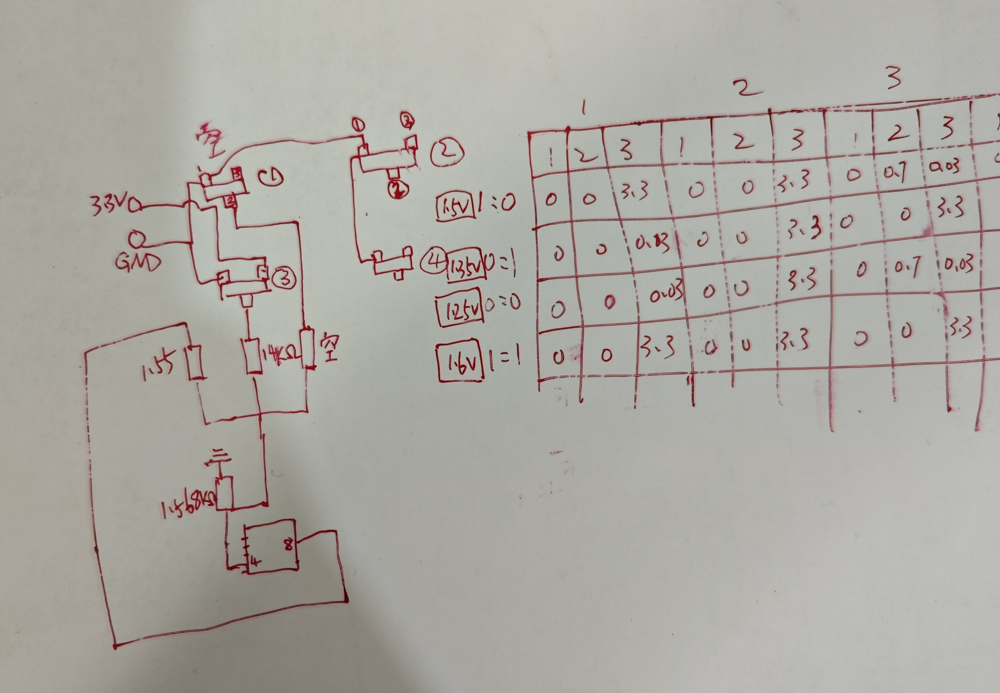
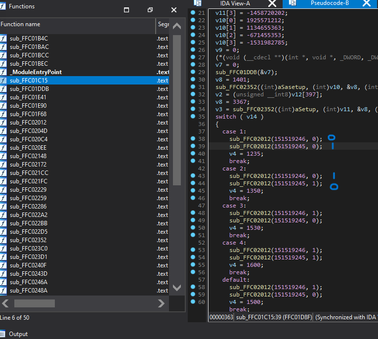

# q1hyUnlock
for some disscutions of ICCMAX and vddq unlocking on q1hy modt

## ICCMAX电流墙
主板在启动的初始化阶段禁用了VR Current Limit选项，所以即使用AMIBCP或者uefi tool修改了对应
的数值，在启动阶段也不会生效。

主板在bios初始化阶段（DXE）会对CPU内部msr寄存器进行读写操作以用于初始化CPU，其中
就包括了设置ICCMAX电流墙。

具体实现如下：
    
写入：   
wrmsr 0x150 0x8000001700000280

读取：  
wrmsr 0x150 0x8000001600000000   
rdmsr 0x150

寄存器地址为0x150，设定值为十六进制的0x280，转换为10进制为640，电流墙为其1/4即160A

### 破解思路  
方法1. 找到主板禁用VR Current Limit选项的代码，用IDA跳过代码
方法2. 在DXE阶段插入上述指令使其每次启动都能执行，十六进制代码如下  
BA 17 00 00 80 B8 20 03 00 00 B9 50 01 00 00 0F 30

## 内存VDDQ电压解锁
此系列modt主板使用的内存PWM芯片为APW8828  
电路图如下  
 
输出电压是通过调节FB引脚上的Rtop和Rgnd来实现的  
 

这里补一张电路图实测  
   

由于出厂时少了一组三极管和电阻，目前只能实现1.23v和1.35v这两电压。  

### 破解思路  
方法1. 修改配置电阻Rtop的阻值，将其从1.55K某木调整为1.9K欧姆，则可实现1.55v的vddq，且不需要修改bios选项  
     
方法2. 补齐三极管和对应的电阻，电阻阻值未知，但从分析来看可能也是14K欧姆的。  
另外还有个电容在三极管边上，应该为输入的滤波。  
此方法需要修改bios调出隐藏的VDDQ 1.5V和1.6V选项  
   
或者修改bios下的turbopei EFI文件，将case1的00改成01，将case2的01改成10，则可实现1.35V和1.5V的VDDQ    
  

