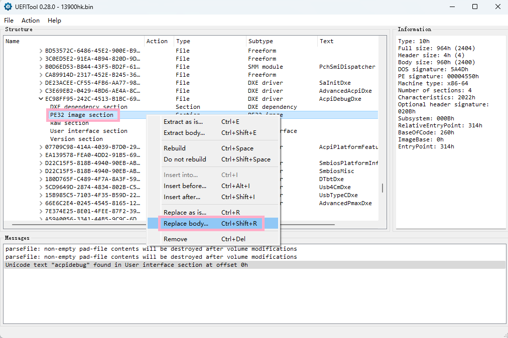
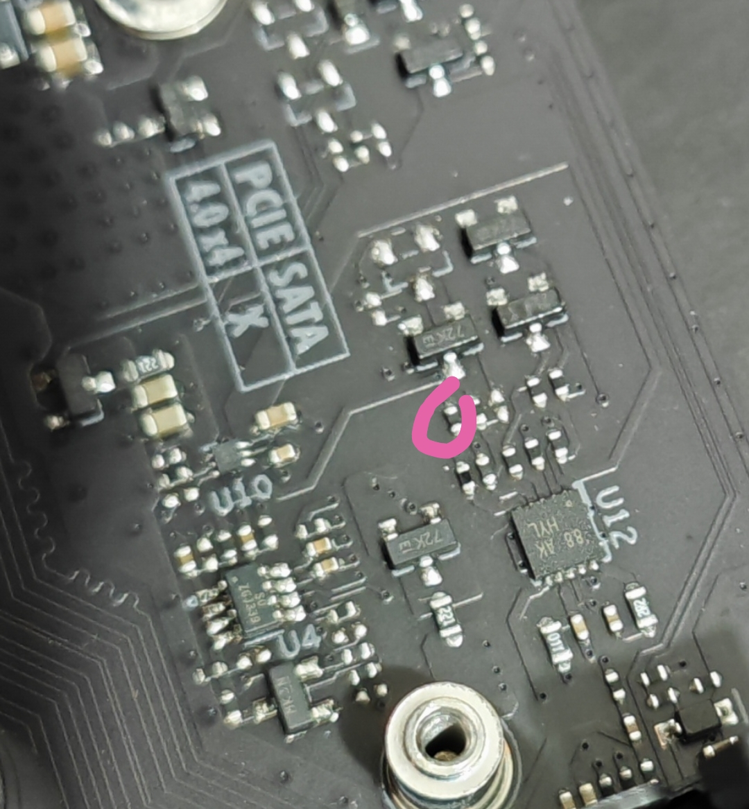

# q1hyUnlock
for some disscutions of ICCMAX and vddq unlocking on q1hy modt

## ICCMAX电流墙 和 ring频率
### ICCMAX电流墙
主板在启动的初始化阶段禁用了VR Current Limit选项，所以即使用AMIBCP或者uefi tool修改了对应
的数值，在启动阶段也不会生效。

主板在bios初始化阶段（DXE）会对CPU内部virtual msr寄存器进行读写操作以用于初始化CPU，其中
就包括了设置ICCMAX电流墙。

具体实现如下：
    
写入：   
wrmsr 0x150 0x8000001700000280

读取：  
wrmsr 0x150 0x8000001600000000   
rdmsr 0x150

寄存器地址为0x150，设定值为十六进制的0x280，转换为10进制为640，电流墙则为其1/4即160A。

### ICCMAX电流墙破解思路  
##### 方法1. 
找到主板禁用VR Current Limit选项的代码，用IDA跳过代码  
##### 方法2.
在DXE阶段插入上述指令使其每次启动都能执行，十六进制代码如下  
BA 17 00 00 80 B8 20 03 00 00 B9 50 01 00 00 0F 30
#### 方法2教程如下：
1. 用 [UEFI Tool](https://github.com/LongSoft/UEFITool "uefiTool")。 打开想要解锁电流墙的
bios（module文件夹下已提供）  
 
2. 按ctrl+F弹出搜索框，在Text选项卡中搜索acpidebug
 
3. 双击底部的搜索结果会跳转到AcpiDebugDxe模块  
   
4. 选择PE32 image section 项目，右键选择Replace body  
  
5. 选择module文件夹下的Section_PE32_image_AcpiDebug_AcpiDebugDxe_body_XXXa.efi
文件，一共提供了200a和400a两个，自行选择需要解锁的电流墙文件即可。选择后点击打开  
6. 打开后如下图所示  
  
7. 选择右上角file->Save image file保存即可，后续按正常流程刷入即可。
  
8. 解锁400a电流墙效果如下  
  

### ring超频
主板默认开启ring down bin模式且主板ring相关设置无效，
所以这里提供另一种思路用于ring超频。  

#### 直接设置ring的最大最小频率为同一数值

具体实现如下：
    
写入：   
wrmsr 0x620 0x000000000000XXYY  

其中XX代表最小频率、YY代表最大频率  
 
#### 教程同ICCMAX方法2，efi文件结尾带47ring的为ring超频版本，未带此字样的为默认版本。
#### 特别注意：超ring频率会使CPU电压增加,同时主板ring的offset选项失效，已在module增加-100mv电压offset的efi模块

### 此文件仅适用于q1hy modt itx版本，其余主板未知。魔改bios须自行承担刷坏的风险与责任。

  
===========================================================================    
  
  
## 内存VDDQ电压解锁
此系列modt主板使用的内存PWM芯片为APW8828  
电路图如下  
 
输出电压是通过调节FB引脚上的Rtop和Rgnd来实现的  
 

这里补一张电路图实测，感谢天邦群友绘制的电路图  
   

由于出厂时少了一组三极管和电阻，结合电压计算公式带入Rtop和Rgnd，
在3号三极管截至的情况下，最高电压为1.38V，
即bios内存电压选项中的1.35V；当3号三极管导通，Rgnd整体阻值降低，内存电压也来到1.25V，即
bios内存电压选项的1.23V.

### 破解思路  
  
#### 方法1. 改电阻
修改配置电阻Rtop的阻值，将其从2.68K欧姆调整为3.2K欧姆，则可实现1.5v的vddq，且不需要修改bios选项,
此时bios内存vddq电压的1.35V即为1.5V,同时原本的1.23v档位的内存电压即为1.35V。  
这个就根据自己内存情况来调整阻值就行。  
     
#### 方法2. 补空焊盘
补齐三极管和对应的电阻，电阻阻值7.5K欧姆，这样可以实现4档内存电压即1.23V、1.35V、1.5V和1.6V（好像1.6v档位会导致不开机）    
另外还有个元件在空的三极管左边，感觉是滤波电容，可以不用管。  
   
此方法需要修改bios调出隐藏的VDDQ 1.5V和1.6V选项。  
bios文件可以找b站用户：**[just我觉得](https://space.bilibili.com/104188156 "just我觉得")。** 

**重要：修改后先拆除内存和硬盘再上电，
用万用表测量vddq电压在合理范围（1.2v-1.6v）内再插内存，
vddq电压在主板24pin端口处能测量到，如下图**

 
